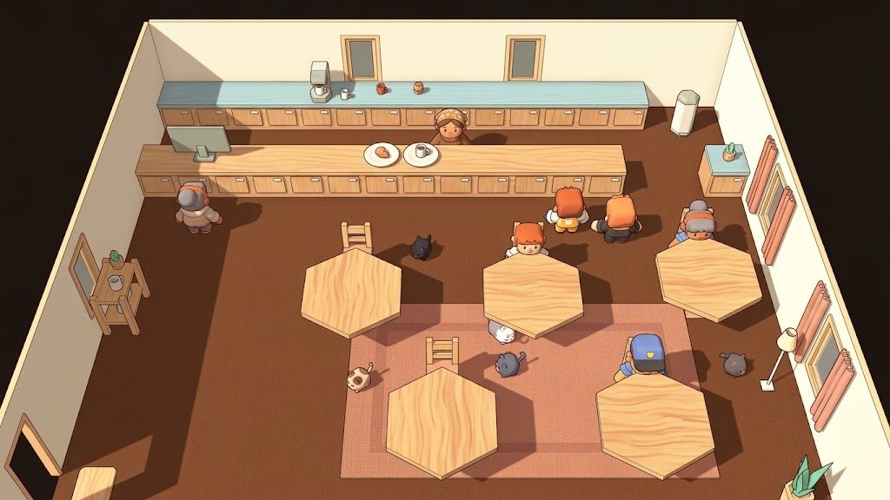
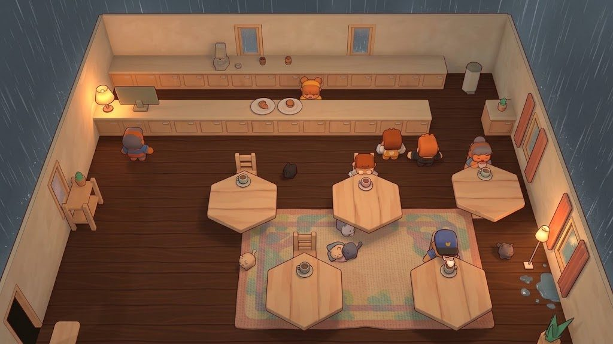
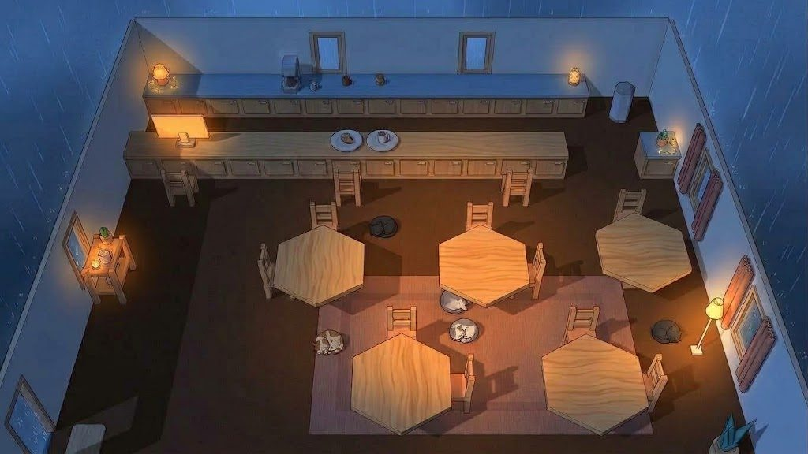
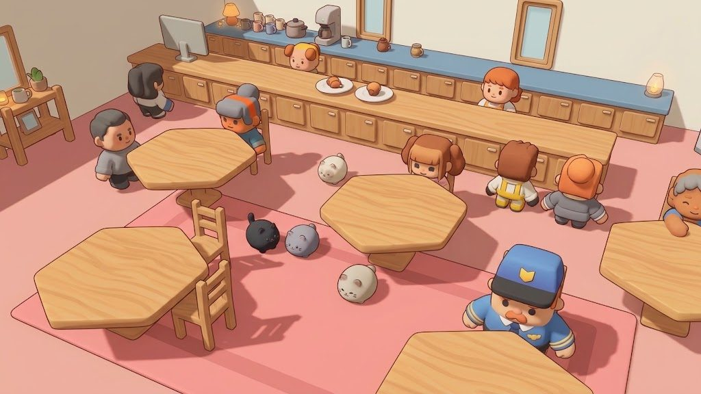
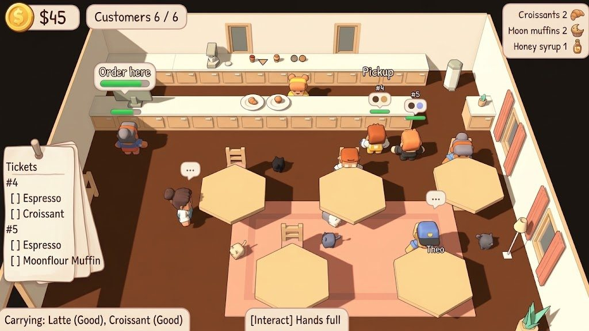

# Atmosphere, Art & Audio

Part of [[- Overview|Cat Cafe Dungeon Crawler]] · status tags: see the legend in the hub · [[Decision Log]] · [[Open Questions]]

- `[DECIDED]` The cafe is **very cozy** with **jazzy music** (lo-fi / cafe jazz) and a comforting atmosphere, as in Coffee Talk.
- `[DECIDED]` Coffee Talk achieves its mood through **restraint**: warm lighting, slow pacing, nothing rushing you. The cafe should have **calm periods before opening and after closing** that feel like a breather.
- `[DECIDED]` **Dynamic music** (agreed direction), with brainstormed specifics:
  - purring adds soft layers as more cats settle in
  - the tempo picks up during a rush
  - rain on the windows changes the mix
- `[PROPOSED]` The dream realm's look and sound: eerie, strange, occasionally melancholy, but not grim or gory.

## Needs expansion
- `[OPEN]` Art style overall. The cafe has a leaning (below); the **dream half** is still open (the 2D dungeon
  suggests pixel art or hand-drawn, but this hasn't been discussed), as is how the two halves relate visually.
- `[DECIDED]` (2026-10-01) The cafe is **full 3D with a perspective camera** that looks at the counter from the front of house and softly follows the player. Movement in the 3D part of the game should **feel good**: responsive starts and stops, no sliding.
- `[REJECTED]` (2026-10-01) A fixed **isometric** camera (decided 2026-09-30, then prototyped). In practice it felt limiting and a bit ugly.
- `[LEANING]` (2026-10-02) **Cafe look: soft stylized 3D**, in the family of *Animal Crossing: New Horizons*:
  - chunky, rounded characters with simple faces (dot eyes, rosy cheeks), close to the current Kenney
    characters' proportions;
  - furniture and floors with **painted wood grain**, patterned rugs and fabrics;
  - **soft shading with faint outlines** rather than hard cel bands;
  - mood carried by **lighting**: warm lamps pooling light, soft shadows, cool light from the windows, and
    weather outside (rain).

  It held up across daytime service, a rainy evening and after closing, which were explored as AI
  paintovers of prototype screenshots (references only, not game art). To discuss together before deciding.
  Things to watch: characters and cats must stay **readable** against the warm wood at the game camera (a rim
  light, stronger outline or a little reserved saturation), and the wood and fabric textures are the part that
  needs new art (the rest is lighting and shaders).

  
  
  
  

  *AI-generated concepts (image editing over prototype screenshots), 2026-10-02. Mood references only.*
- `[OPEN]` **What the cats look like.** The concepts turned them into round, almost legless "mochi" shapes:
  adorable, but cats need readable silhouettes and poses (sitting, walking, being petted, climbing the
  curtains, fighting, carrying a stolen croissant) and should show their personalities. Explore separately.
- The dungeon's music direction.
- `[LEANING]` (2026-10-02) **UI style: cozy paper and card panels**, matching the cafe look: cream, rounded
  cards with soft shadows and a friendly rounded font; **icons** for money and stock (coin, croissant, muffin,
  honey jar); **order tickets as paper slips pinned to a nail**; speech-bubble signs and bubbles over customers.
  Explored as an AI paintover of a prototype screenshot (reference only). To discuss together before deciding.
  Things to change from the concept: it's **too big** (the ticket stack hides the queue along the left wall);
  keep the UI **compact**. Tickets should be **one small slip per order with item icons** that tick off, not
  text checklists. The "Carrying" line is mostly redundant now that items show in the barista's hands. The
  interact prompt wants a key icon, and light cards need enough contrast against the pale walls.

  

  *AI-generated concept (image editing over a prototype screenshot), 2026-10-02. Mood reference only.*
